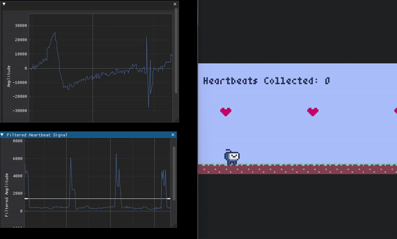
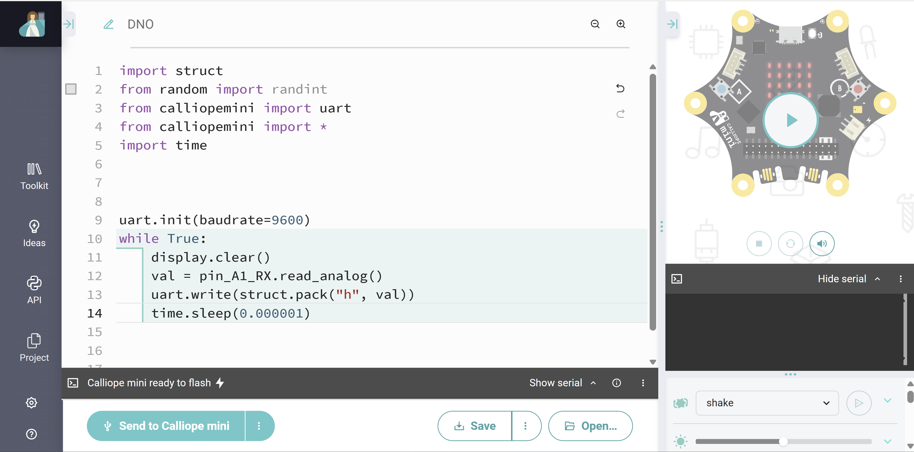
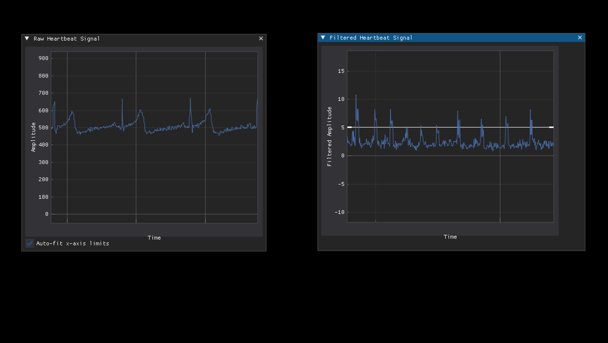
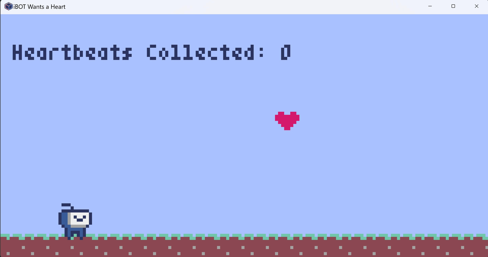

## Game Demo

- Two-player game
- Player 1
  - Stick electrodes in the following locations
    - left arm (less muscular area)
    - right arm (less muscular area)
    - right leg near the shin
  - Set threshold on the `Filtered Heartbeat Signal` by manually dragging the horizontal line. A heart shows up on the game window.
- Player 2
  - Collect hearts in the game by jumping (`spacebar`) to get points!
  

## Heart Signal Acquisition

### Setup and Installation
Shopping List:
  - [Calliope Mini v3](https://webshop.calliope.cc/Calliope-mini-3)
  - [ECG Board](https://www.amazon.de/ICQUANZX-EKG-Messung-Herzfrequenzsensor-EKG-%C3%9Cberwachungssensor-Dupont-Kabel/dp/B088R8VZ74/ref=pd_ci_mcx_mh_mcx_views_0_title?pd_rd_w=FjomC&content-id=amzn1.sym.7f9b9996-bc03-4d04-b9b7-40b61293137b%3Aamzn1.symc.ca948091-a64d-450e-86d7-c161ca33337b&pf_rd_p=7f9b9996-bc03-4d04-b9b7-40b61293137b&pf_rd_r=RP5V23MAQJJ8NGCF6T56&pd_rd_wg=JfFkW&pd_rd_r=014bdd7b-121c-438e-b576-18b0b160b8c6&pd_rd_i=B088R8VZ74) 
  - [Grove Breakout Cable](https://www.amazon.de/dp/B0DGGJKNTS?ref=ppx_yo2ov_dt_b_fed_asin_title)
  - [ECG Electrodes](https://www.amazon.de/Elektroden-Festgel-Solidgel-Einmalelektroden-Einmal/dp/B005N6WIMY/ref=sr_1_5?crid=J0LT6NKQJASH&dib=eyJ2IjoiMSJ9.z82MJqBLnd2-4DiSVrXoQguPVJyTu5JyHRry71cZ8gH_mpZhQ7qKGVUi7hcxL1IJtn9tvyLC7cQmOu-fkkENYCl45fwh7jPGmIbcon9CLo9Fby3Ztj96yiSfantnUTJctKPQUeZgzaHXErKrRiiqkN4v8ed_Fgv4VbVmMXTlq2LpodVeMqupfgcxeWcHyquTz_5_pgqhX-LuoF2oK2shzvj9VEWSAwMJzmdr32Mn1Z14V0j7vtAvO4dxnwUzVrq2qcO9HJUiF53dy8ClJlj-A_EdIye-XAt0O5uIIkCxBxYMUY00ipHqyYFKr47FWBrWImOip1GZu0lRIpAfBmrmyFdEZ_T_3Ik--iSwWcyRMORjOkYWHa3_MveZtTvoAINnqz_isrlTToHM37C5EJwfzKbhMRd8deeV-rm0ZZNKOORn8pPazG0wfzF_VUOfolTd.UFbU1L5HXchHcOQu2yUtwXtEuXjIbVGFwIYUkfuRyKQ&dib_tag=se&keywords=ecg+electrodes&qid=1742401007&sprefix=ECG+Elec%2Caps%2C93&sr=8-5)

## ECG Data Acquisition GUI

### Calliope and ECG Board

1. Connect calliope mini v3 device from the [Calliope Editor](https://python.calliope.cc/).
2. Copy and paste the code from `calliope_code.py` to the editor and upload the code to the device.
3. Connect ECG board to calliope device at `A1 RX` pin

### ECG Stream

(Note: Currently, the gui has only been tested on windows, but should work on other platforms as well.)

  1. Install Pixi: `winget install --id=prefix-dev.pixi`
  2. Set the `CALLIOPE_PORT` value in the `plot_ecg.py` file to match your device's location.  
  3. Run the App (will auto-install any dependencies): `pixi run ecg`
  4. Use the scroll button on the mouse to zoom in and out, and drag the white threshold line in "Filtered Heartbeat Signal" to just below the maximum point where a heartbeat signal happens!  You'll know it's working from the terminal: "Heartbead detected" will be printed each time the filtered signal goes above the threshold line.

## iBOTS Heart Jump Game

(Note: Currently, the game has only been tested on windows, but should work on other platforms as well.)

  1. Install Pixi: `winget install --id=prefix-dev.pixi`
  2. Run the App (will auto-install any dependenci)s: `pixi run game`

